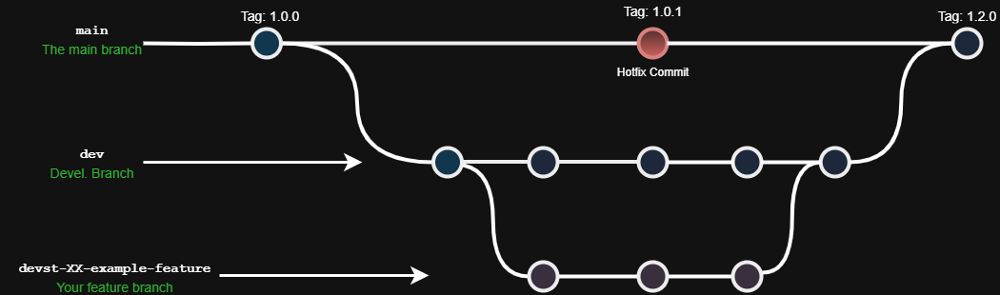

# Projeto Devstão

## Fluxo de desenvolvimento das branchs
Vamos seguir o seguinte fluxo simples de desenvolvimento das branchs:

A branch de produção será a main, toda versão testada e finalizada será deixada aqui.
A branch de desenvolvimento geral, para testes e afins, ficará nesse branch (dev).
Qualquer outra tarefa será realizada na sua própria branch e entrará como pull request para a dev.

Fluxo para a prod:

branch-feature -> dev -> main
